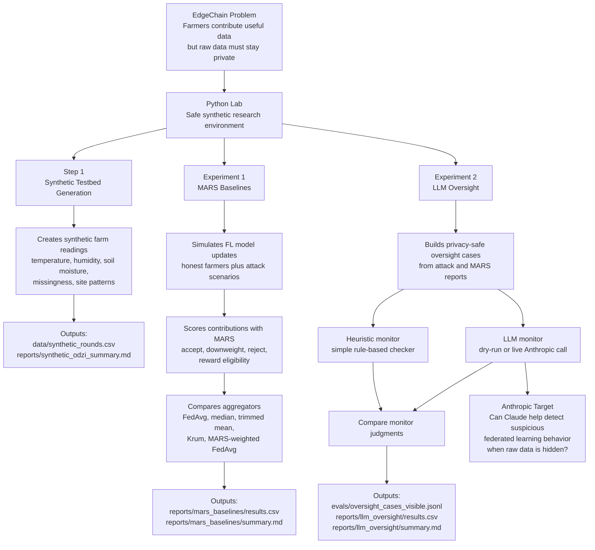
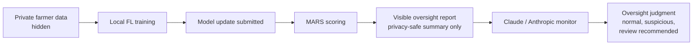

# EdgeChain Python Lab Experiment Demo Guide

## Purpose

EdgeChain Python Lab is a reproducible research environment for testing privacy-preserving federated learning in an Odzi-like smallholder agriculture setting.

The lab answers one central question:

```text
How do you supervise and reward contributors in a privacy-preserving federated
learning system when the system is not allowed to inspect the raw evidence?
```

The experiments use synthetic or public-safe data only. They do not expose real farmer identities, private keys, wallet data, raw pilot readings, real GPS coordinates, or deployment secrets.

## The Big Picture



## Simple Pipeline

```text
Synthetic world
  -> federated learning behavior
    -> MARS scoring
      -> oversight cases
        -> Anthropic / LLM evaluation
```

Or, in demo language:

```text
1. Generate safe fake farm data.
2. Simulate federated learning contributions and attacks.
3. Score contributions with MARS.
4. Build privacy-safe oversight reports.
5. Test whether an LLM can reason over those reports.
```

## Step 1: Synthetic Testbed Generation

Run:

```bash
uv run python -m edgechain_lab.experiments.synthetic_odzi
```

This step creates a fake but realistic Odzi-like research world. Strictly speaking, it is not a hypothesis-testing experiment. It is the dataset/testbed construction step that the actual experiments run against.

It generates synthetic readings for:

```text
temperature
humidity
soil moisture
missing readings
site differences
sensor behavior
```

It helps demonstrate:

```text
We can test EdgeChain safely without exposing real farmers or real pilot data.
```

Outputs:

```text
data/synthetic_rounds.csv
data/synthetic_rounds.parquet
reports/synthetic_odzi_summary.md
```

The CSV is the human-inspection format. The Parquet file is the data/ML pipeline format: it preserves column types better, loads faster, and is a common industry format for analytics and machine learning workflows.

### What "Rounds" Mean Here

In `synthetic_rounds.csv`, a round is one shared simulation time step. The current generator uses hourly rounds:

```text
round_id = 0  -> first simulated hour
round_id = 1  -> second simulated hour
round_id = 2  -> third simulated hour
```

Each round contains one row per synthetic site. With 48 rounds and 7 sites, the generator creates about:

```text
48 rounds x 7 sites = 336 rows
```

The distinction is:

```text
timestamp = clock time
round_id = shared experiment / FL coordination step
```

This is "epoch-like" in the loose sense that it repeats over time, but in federated learning a round is not the same as a local training epoch. A round is the shared cycle across clients/sites; an epoch is one pass through a client's local training data.

## Experiment 1: MARS Baselines

Run:

```bash
uv run python -m edgechain_lab.experiments.mars_baselines
```

This is the main federated learning experiment.

It asks:

```text
When farmers submit model updates, can we score contribution quality fairly
without seeing their private raw data?
```

It tests scenarios such as:

```text
honest baseline
legitimate non-IID divergence
invalid attestation
single adversary
two adversaries
colluding majority
sensor failure
calibration drift
```

It compares aggregation methods:

```text
FedAvg
median
trimmed mean
Krum
MARS-weighted FedAvg
```

The aggregators are the five ways the lab combines many farmer/client updates into one global model update. This column exists because MARS needs to be compared against standard and robust baselines, not judged in isolation.

Simple rationale:

```text
many local updates -> aggregator -> one global update
```

The baseline question is:

```text
Does MARS-weighted aggregation behave better or more fairly than standard
aggregation methods under honest, adversarial, sensor failure, and drift scenarios?
```

The five implementations currently exist in:

```text
src/edgechain_lab/fl/aggregation.py
```

`mars_baselines.py` applies those five algorithms across the configured scenarios and records comparable metrics.

The important questions are:

```text
Did malicious updates get accepted?
Did honest farmers get wrongly rejected?
Did attackers receive reward share?
How far did the model move from the honest baseline?
Which aggregator failed under which attack?
```

Outputs:

```text
reports/mars_baselines/results.csv
reports/mars_baselines/summary.md
```

## Experiment 2: LLM Oversight

Run:

```bash
uv run python -m edgechain_lab.experiments.llm_oversight
```

This is the Anthropic-relevant experiment.

It asks:

```text
Can an LLM help audit suspicious federated learning behavior when the raw
farmer data remains hidden?
```

The LLM does not receive:

```text
raw farm readings
farmer identity
private keys
wallet data
real GPS coordinates
secret deployment data
```

The LLM receives privacy-safe summaries such as:

```text
scenario behavior
MARS scores
accepted/rejected counts
reward share patterns
aggregator outcomes
visible round reports
```

Then it tries to judge:

```text
Does this look normal?
Does this look suspicious?
Should a human review it?
Is there a coordinated attack pattern?
```

This experiment compares:

```text
heuristic monitor
vs
LLM monitor
```

The heuristic monitor is a deterministic rule-based checker. It is the simple baseline:

```text
if too many clients are rejected -> suspicious
if too few eligible clients remain -> skip round
if spatial jury scores split into separated groups -> possible collusion
```

The LLM monitor receives the same privacy-safe report and tries to reason over the pattern. By default, this project uses a dry-run LLM placeholder; live Anthropic calls are opt-in.

The experiment asks:

```text
Does the LLM add useful oversight beyond simple hand-written rules?
```

Outputs:

```text
evals/oversight_cases_private.jsonl
evals/oversight_cases_visible.jsonl
reports/llm_oversight/results.csv
reports/llm_oversight/summary.md
```

The key public-safe artifact is:

```text
evals/oversight_cases_visible.jsonl
```

That file represents the kind of information an oversight model can see without violating the privacy assumptions of EdgeChain.

## Where Anthropic Fits



The Anthropic pitch is not:

```text
Claude looks at all farmer data.
```

The pitch is:

```text
Claude helps supervise coordination failures using only privacy-preserving
summaries.
```

## Demo Script

From the Python Lab directory:

```bash
cd /Users/solomonkembo/Downloads/EdgeChainWorkspace/edgechain/research/python-lab
uv sync
uv run pytest
uv run python -m edgechain_lab.experiments.synthetic_odzi
uv run python -m edgechain_lab.experiments.mars_baselines
uv run python -m edgechain_lab.experiments.llm_oversight
```

Then show:

```text
data/synthetic_rounds.csv
reports/synthetic_odzi_summary.md
reports/mars_baselines/results.csv
reports/mars_baselines/summary.md
evals/oversight_cases_visible.jsonl
reports/llm_oversight/results.csv
reports/llm_oversight/summary.md
```

## Current Demo Surfaces

There are two different demo surfaces:

```text
Learning app:
  Explains the concepts visually.

Python Lab:
  Runs the actual experiments and produces artifacts.
```

The learning app is not currently a click-to-run experiment GUI. It is a visual coach and explanation layer.

The Python Lab is the actual reproducible experiment harness.

## Current State

The lab currently supports:

```text
terminal-runnable experiments
generated CSV and Markdown reports
synthetic Odzi data generation
adversarial FL scenarios
MARS contribution scoring
baseline aggregator comparison
dry-run LLM oversight
optional live Anthropic monitor
```

It does not yet include:

```text
full GUI experiment runner
browser form for entering scenario values
click-to-run dashboard
```

## Optional Live Anthropic Mode

By default, the LLM oversight experiment runs in dry-run mode. That means it does not call the Anthropic API.

Live Anthropic calls are opt-in.

The code only attempts a live call when:

```bash
EDGECHAIN_LIVE_LLM=1
```

An Anthropic API key must also be available in the environment.

Conceptually:

```text
MARS produces visible round reports.
The LLM receives only privacy-safe visible data.
The LLM judges whether the pattern looks normal or suspicious.
```

## Final Narrative

For Anthropic, the clean demonstration story is:

```text
EdgeChain simulates a privacy-preserving agricultural federated learning network.

Farmers keep raw data private.

MARS scores whether model contributions seem useful, honest, or suspicious.

The Python Lab tests failure modes such as adversaries, sensor failures,
calibration drift, and colluding majorities.

Then LLM oversight tests whether Claude can help identify suspicious patterns
from privacy-safe reports, without seeing raw farmer data.
```

The connectedness is:

```text
Synthetic testbed generation creates the world.
MARS tests contribution fairness.
Attack scenarios test failure modes.
LLM oversight tests whether Claude can help catch or explain those failures.
```
